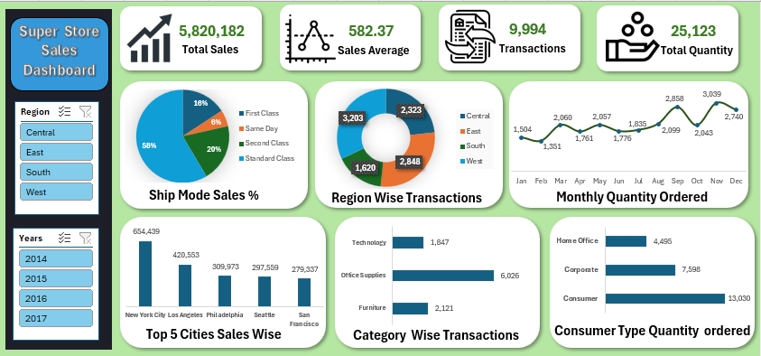

# 📊 Super Store Sales Dashboard

This interactive *Sales Dashboard* was built using *Microsoft Excel*. It provides key insights into Super Store performance using Pivot Tables, Charts, Slicers, and Conditional Formatting.

---

## 📌 Key Insights Covered

- 💰 *Total Sales, **Average Sales, and **Transaction Count*
- 🚚 *Ship Mode* and *Region-wise* Sales Distribution
- 📆 *Monthly Quantity Trend* (Jan to Dec)
- 🏙 *Top 5 Cities* with highest sales
- 🗂 *Category-wise* Transaction Count
- 👥 *Consumer Type-wise* Quantity Ordered

---

## 🛠 Tools Used

- Microsoft Excel
- Pivot Tables
- Charts & Graphs
- Slicers & Filters

---

## 📷 Dashboard Preview

---

## 📥 Download the Dashboard

[Click here to download the Excel file](assets/SuperStoreDashboard.xlsm)

---

## 📧 Contact

For any queries or dashboard customization requests:  
📩 *akashgaud0x0@gmail.com*  
📱 *+91-8356005426*

---

⭐ If you like this project, feel free to give a ⭐ on GitHub and share your feedback!
